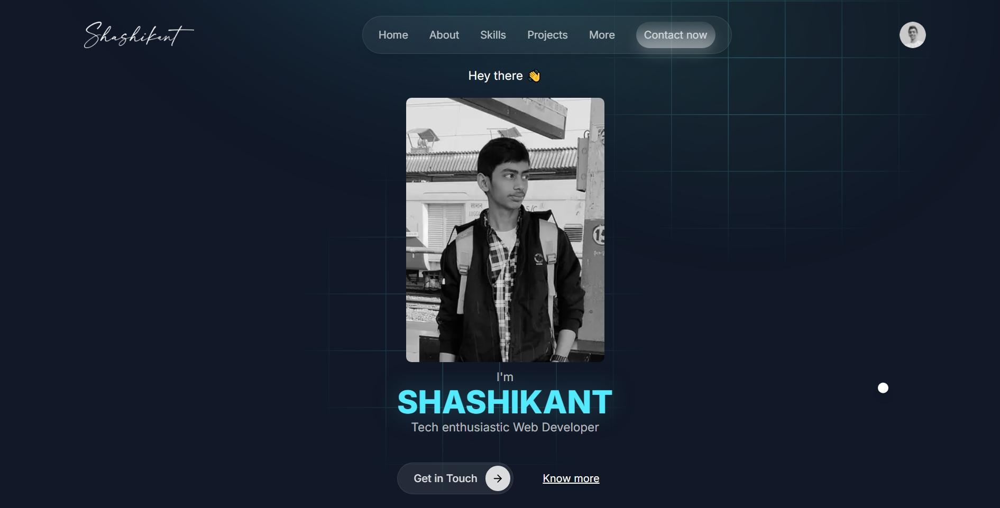

# Portfolio Website

Welcome to my personal portfolio website! This site highlights my projects, skills, and experiences in web development.

## 🌐 Live Demo

Check out the live version here: [mr-shashikant.vercel.app](https://mr-shashikant.vercel.app)

## ✨ Features

- **Project Showcase:** A list of selected projects with descriptions and links.
- **Skills Section:** Technologies and tools I work with.
- **Responsive Design:** Optimized for desktops, tablets, and mobile devices.
- **Smooth Navigation:** Simple and intuitive UI.
- **Contact Info:** Easy ways to connect with me.

## 🖼️ Screenshot



## 🛠️ Technologies Used

- **Frontend Framework:**
  - React
- **Styling:**
  - Tailwind CSS
- **Animations:**
  - GSAP (GreenSock Animation Platform)
- **Tooling & Build:**
  - Vite
  - Git & GitHub
- **Deployment:**
  - Vercel

## 🚀 Getting Started

To run this project locally:

### 1. Clone the repository

```bash
git clone https://github.com/Mr-Shashikant/portfolio.git
